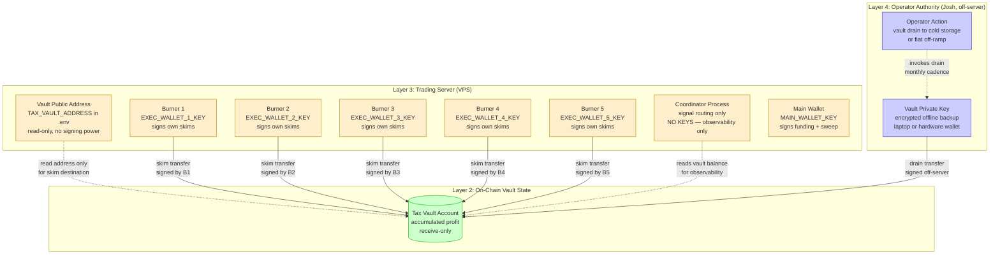

# Architecture Decision Record — Multi-Wallet Topology

**Project:** Moss Lane
**Component:** Lazarus Engine — Phase 3 Wallet Topology (5 burners + coordinator + tax vault)
**Author:** Josh Hillard (TPM #4), with DevOps #6 (lead), SecOps #2, SRE #1 review
**Date:** 2026-04-29
**Status:** Implemented (2026-04-30); enforcement landed in [github-repo/docs/build-log/2026-04-30-adr006-vault-split.md](../docs/build-log/2026-04-30-adr006-vault-split.md) — supersedes the unresolved topology layer of Phase 2 dispatcher work
**Predecessor:** [ADR_Dispatcher_Architecture_2026-03-31.md](ADR_Dispatcher_Architecture_2026-03-31.md) (ADR-001 keys, ADR-002 signal distribution, ADR-003 skim timing)
**Reviewers:** DevOps / Release Engineer, Principal Cloud & SecOps, SRE Lead, Senior TPM

---

## Executive Summary

The Phase 2 dispatcher ADR resolved three primitives: how keys are stored, how signals are distributed, and when skims fire. It did not resolve the topology layer that sits above those primitives — the question of how seven distinct wallets are arranged into a coherent capital system, what flow paths between them are allowed, and where trust boundaries fall.

This ADR draft proposes that topology. It records four decisions:

- **ADR-004:** Wallet roles and identity assignment (homogeneous burners vs. role-tiered burners)
- **ADR-005:** Capital flow paths — allowed and forbidden movements between the seven wallets
- **ADR-006:** Tax vault posture — receive-only with manual outbound, no programmatic withdrawal
- **ADR-007:** Coordinator authority over capital — signal-only, never a custodian

These four decisions explicitly preserve, and do not re-implement, the existing 12-point fail-closed entry gate at [github-repo/src/engine/lazarus.py:677-734](../src/engine/lazarus.py) and the 7-tier exit priority chain at [github-repo/src/engine/lazarus.py:1008-1044](../src/engine/lazarus.py). The topology operates *underneath* those gates; it does not replace them.

---

## ADR-004: Wallet Role Assignment — Homogeneous vs. Tiered

### Context

Phase 2 generated five execution wallets and one tax vault via [github-repo/src/finance/wallet_generator.py::generate_wallets](../src/finance/wallet_generator.py). All five execution wallets currently receive equal allocation (20% each) per `ALLOCATION_PERCENTAGES` at [github-repo/src/finance/wallet_generator.py:51-58](../src/finance/wallet_generator.py). They are interchangeable.

The dispatcher coordinator (ADR-002 in the predecessor doc) routes signals to wallets, but the routing rule is not yet defined. Two topologies are viable:

- **Option A — Homogeneous Burners.** All five wallets receive the same filter regime, the same position-sizing rule, and the same signal stream. The coordinator load-balances signals across whichever wallet has capital and is not on cooldown. Each burner is a clone.

- **Option B — Tiered Burners.** Wallets are assigned distinct strategy roles. Example: Wallet 1–2 run tightest filters with largest position size (high-conviction), Wallet 3–4 run standard filters with median size, Wallet 5 runs widest filters with smallest size (experimental). The coordinator routes by signal score band.

### Decision

**Option A — Homogeneous Burners for the topology baseline.** Tiered routing is deferred to a future ADR pending live evidence.

All five execution wallets share the same filter regime (the current 12-point gate), the same position-sizing rule (paper-mode dynamic balance × per-trade pct), and the same exit chain (7-tier). The coordinator load-balances by next-available wallet, not by signal score band.

### Rationale

1. **Evidence gap.** The project has no live performance data segmented by filter regime tier. Bowing the topology to a tiered hypothesis right now means committing capital allocation rules to a guess. Per the *Trust Model* (Foundations/Moss Lane System Trust Model.md), strategic interpretation is the layer with the least mechanical proof — tiered routing belongs there, not in the topology baseline.

2. **Filter divergence is a documented anti-pattern.** ADR-002 in the predecessor doc explicitly chose a single scanner partly to avoid divergent filter configurations across processes. Tiered burners reintroduce the same risk one layer up: now five wallets each carry their own filter set, and learning attribution becomes per-wallet rather than per-regime. The Foundations doc *Runtime Validation* lists "regime-aware learning attribution" as a known gap; tiered burners would compound it.

3. **Stoic Gate sample-size discipline.** Bounded learning requires N trades per regime to mature. Five tiers × N trades is 5× the warm-up time. Homogeneous burners pool trades into one regime, preserving the existing learning-window math.

4. **Quarantine simplicity.** [github-repo/src/finance/fund_splitter.py::FundSplitter.quarantine_wallet](../src/finance/fund_splitter.py) treats wallets as fungible — quarantining one wallet redistributes its allocation to the remaining four. Tiered burners would require role re-assignment on quarantine ("if Wallet 1 is down, who takes the high-conviction tier?"), introducing failure-mode complexity that has no current upside.

### Tradeoffs

- **No early signal differentiation.** If the project later proves that tightest-filter signals deserve larger positions, the topology has to be retrofitted. We accept this — retrofit cost is bounded (config change + per-wallet bot_config rows), and the alternative is committing to a tier hypothesis without evidence.

- **Five wallets contribute identical learning data.** A homogeneous fleet provides more samples per epoch but no insight into regime sensitivity. Mitigation: the `wallet` field already exists in the trade table per the *Transaction Identity* foundation, so segmented analysis is available retroactively if needed.

- **Coordinator load-balancing is the only routing rule.** That rule needs to be deterministic and auditable. Mitigation: documented in ADR-007 below.

### Consequences

- All five burners use the same `CFG` dict (the current global config in `lazarus.py`).
- Per-wallet config divergence requires an explicit ADR amendment.
- `wallet` is recorded on every trade (already true) so future tier analysis is possible without migration.
- A future ADR-009 may introduce tiered burners; this ADR is the explicit baseline it would supersede.

---

## ADR-005: Capital Flow Paths — Allowed and Forbidden Edges

### Context

Seven wallets exist: Main (deployer/funding source), Burner 1–5 (executors), and Tax Vault (skim destination). Without an explicit topology, the system has 7 × 6 = 42 directed edges of possible capital movement. Most should be forbidden. The question is which edges are *allowed* and which are *enforced as forbidden*.

The existing code already implements three edges:

- **Main → Burner N** via [github-repo/src/finance/fund_splitter.py::FundSplitter.calculate_allocations](../src/finance/fund_splitter.py) (initial funding + top-up)
- **Burner N → Tax Vault** via [github-repo/src/finance/tax_vault.py::TaxVault.calculate_skim](../src/finance/tax_vault.py) (15% profit skim)
- **Burner N → Jupiter program → Burner N** (trade execution; capital stays in the same wallet)

Three more edges are plausible candidates:

- **Burner N → Main** (sweep on quarantine)
- **Burner N → Burner M** (rebalance between burners)
- **Tax Vault → anywhere** (vault outbound)

### Decision

**Five allowed edges, all others forbidden.** The allowed set:

| Edge | Trigger | Initiator |
|------|---------|-----------|
| Main → Burner N | Initial fund + threshold top-up | FundSplitter |
| Burner N → Jupiter → Burner N (same N) | Trade execution | Burner N's own process |
| Burner N → Tax Vault | Accumulated skim ≥ threshold | Burner N's own process |
| Burner N → Main | Quarantine sweep (manual or automated on hard-floor breach) | FundSplitter or operator |
| Tax Vault → external (cold storage / fiat off-ramp) | Manual operator action only | Operator (Josh), never a process |

**Forbidden edges:** Burner ↔ Burner (no rebalancing between burners), Tax Vault → Burner (vault never funds trading), Tax Vault → Main (vault never refills hot capital), and any edge that crosses tier without explicit operator action.

### Rationale

1. **Forbidden Burner ↔ Burner preserves blast radius.** ADR-001 (independent keypairs) was chosen so a compromise of one key cannot drain the others. If Burner 1's process can sign a transfer to Burner 2's address, then a compromised Burner 1 process can drain Burner 2 by transferring out before Burner 2 notices. The keys are isolated; the edges should be too. The only inter-burner movement permitted is via Main as an intermediary, which requires the Main wallet's separate signing authority.

2. **Forbidden Tax Vault → trading contains realized profit.** The vault's job is to be a one-way ratchet: profit moves in, profit does not move out programmatically. If a future drawdown could pull from the vault to refill burners, the vault stops being a fund-isolation mechanism and becomes just another hot wallet. The *Trust Model* foundation lists "do not trust strategy changes that outrun the integrity and rollback path" — programmatic vault refill is exactly that kind of erosion.

3. **Quarantine sweep (Burner → Main) is necessary, not optional.** When a wallet hits the hard floor (-15%) or the operator manually quarantines it, leaving residual SOL in the dead wallet is operationally wasteful. The sweep edge to Main lets the system recover capital under operator control. Critically, it is **Burner → Main, never Burner → another Burner**, which preserves the rebalance-via-intermediary discipline.

4. **Operator-only vault outbound matches existing tax_vault.py guarantee.** The module-level docstring at [github-repo/src/finance/tax_vault.py:17](../src/finance/tax_vault.py) already states "Tax vault is receive-only from executors (no outbound except manual)." This ADR formalizes that as a topology invariant rather than a comment.

### Tradeoffs

- **Rebalancing slowdown.** If Burner 1 has 0.8 SOL and Burner 2 has 0.05 SOL, the only legal way to move SOL from 1 to 2 is via Main (two transactions, two fees, two confirmations). Direct Burner → Burner would be one transaction. We accept the extra fee burn for the security guarantee; a 0.000005 SOL fee × 5 wallets is negligible against a single drained wallet's loss.

- **Manual vault drain is operationally fragile.** If Josh is unavailable and the vault grows large, capital sits idle. Mitigation: vault drain is a low-frequency operation (target: monthly or threshold-based at 5 SOL), and the Foundations doc *Trust Model* explicitly places "interpretation of performance evidence" and "capital exposure" decisions inside Josh's authority bound. This edge is in the right hands.

- **Quarantine sweep needs a signing path.** The Main wallet doesn't sign for Burner N; Burner N must sign its own outbound transfer to Main. That means quarantine sweep cannot recover capital from a key-compromised wallet — only from a balance-deplete or operator-quarantined wallet. We accept this: a compromised key is already a total-loss event for that wallet by ADR-001's design.

### Consequences

- A topology validator must run at startup to refuse any allowed-edge list that contains forbidden edges.
- The dispatcher's allocation logic in [github-repo/src/finance/fund_splitter.py](../src/finance/fund_splitter.py) is already correct for the allowed Main → Burner edge and does not need to change.
- The TaxVault module never receives `transfer_out` or `withdraw` methods. If such a method appears in a future PR, it is a topology violation and must be rejected at code review.
- The `quarantine_wallet` method needs a companion `sweep_to_main` operation (not yet implemented; tracked for Phase 3 slice 2).

---

## ADR-006: Tax Vault Posture — Receive-Only with No Programmatic Outbound

### Context

The tax vault accumulates 15% of realized profit per ADR-003. The vault keypair is generated via [github-repo/src/finance/wallet_generator.py::generate_wallets](../src/finance/wallet_generator.py) and stored in `.env` as `TAX_VAULT_KEY`. The question is what process — if any — should hold and use that keypair.

Three options:

- **Option A — Vault keypair on the trading server.** The vault `.env` entry is loadable by any process on the VPS. Outbound transfers (drain to cold storage, fiat off-ramp) execute via a script invoked by the operator over SSH.

- **Option B — Vault public address only on the trading server.** The vault private key is never present on the trading server. The skim transfer targets the vault's public address only (which doesn't require the vault's signing authority — it's the receiver). The vault keypair lives on a separate device (laptop, hardware wallet, paper backup). Outbound transfers happen entirely off-server.

- **Option C — Vault on a separate process with restricted permissions.** The vault keypair lives on the same VPS but in a separate user account or container, accessible only to a tightly-scoped service.

### Decision

**Option B — Public address only on the trading server.** The vault private key is never present on the production VPS.

The Phase 2 wallet generator currently writes `TAX_VAULT_KEY` to `/home/solbot/lazarus/.env` alongside the burner keys. This ADR proposes removing that write step in Phase 3: only the **public address** is exposed to the trading server (as `TAX_VAULT_ADDRESS`), and the private key is generated on Josh's laptop, written to encrypted offline storage, and never deployed to the server.

### Rationale

1. **The skim transfer doesn't need the vault's private key.** The skim is a SOL transfer *into* the vault, signed by the burner wallet's keypair. The vault is the receiver, not the sender. Solana transfers do not require the receiver's signature. Therefore the vault's private key has no operational reason to exist on the trading server.

2. **Server compromise no longer means vault loss.** If the VPS is compromised — root access, disk image exfiltration, malicious dependency — the attacker gains the burner keys and can drain the burners. Per ADR-001, that's already a contained loss (5 burner wallets, accept it). With Option A, the same compromise also drains the vault, multiplying the loss by however much profit has accumulated. Option B caps the loss at the burner balances. The vault — which by definition holds the profit you most want to preserve — is untouchable from the server.

3. **Aligns with the *Trust Model* layer 4 boundary.** The Foundations doc places "capital exposure" and "interpretation of performance evidence" decisions in Josh's authority bound, not the engine's. Vault outbound is a layer-4 decision. Putting the keypair on a process that can be invoked by a script collapses layer 4 into layer 2 (runtime state). Option B preserves the boundary by making vault outbound *physically impossible* from the trading server.

4. **Removes a dangerous code path before it can be written.** With the vault key on the server, every future code review must ask "does this PR add a path that could spend the vault?" The answer is currently *yes, technically* even though no such code exists. Option B makes the answer *no, structurally* — the key is not on the machine, so no code on the machine can sign for it.

### Tradeoffs

- **Operational friction for legitimate vault drains.** When Josh wants to move vault SOL to cold storage or off-ramp it, he has to use a separate machine. This is a feature, not a bug — friction at the highest-trust boundary is desirable. The frequency is low (monthly at most), and the existing Solana ecosystem has good off-server tooling (Phantom on a clean machine, or `solana-keygen` + `solana transfer` on an offline laptop).

- **Loss of vault private key = loss of accumulated profit.** Backup is critical. The ADR-001 decision (independent keypairs) already requires six backup paths; Option B adds one more requirement: the vault keypair backup must be physically separate from the server's backup chain, because the whole point is that the server has no access to it.

- **Currently violates [github-repo/src/finance/wallet_generator.py::generate_wallets](../src/finance/wallet_generator.py).** The current code generates `TAX_VAULT_KEY` and writes it to `.env` alongside the burner keys. Phase 3 slice 2 must change this: generate vault keypair separately (on laptop), provision only the public address to the server. The wallet_generator's `save_wallets_to_env` must be amended so it skips `TAX_VAULT_KEY` and instead requires `TAX_VAULT_ADDRESS` to be pre-populated by the operator.

### Consequences

- `TaxVaultConfig.tax_vault_address` is read from `.env` (already true at [github-repo/src/finance/tax_vault.py:42](../src/finance/tax_vault.py)). No code change needed for the receive path.
- The wallet generator must be split into a server-side path (burners only) and a separate operator-side script (vault generation, run on Josh's laptop). Phase 3 slice 2 deliverable.
- The `.env` audit at [docs/ENV_AUDIT_AND_SECRET_MANAGER.md](../docs/ENV_AUDIT_AND_SECRET_MANAGER.md) must record that `TAX_VAULT_KEY` is **forbidden** on the production server, not just optional.
- Startup assertions (validation layer 4 in *Runtime Validation*) must check that `TAX_VAULT_ADDRESS` is present and `TAX_VAULT_KEY` is absent, and refuse to start if the relationship is inverted.

---

## ADR-007: Coordinator Authority — Signal-Only, Never a Custodian

### Context

ADR-002 introduced the coordinator process. The predecessor ADR is clear that the coordinator routes signals, but it does not formalize what the coordinator is *forbidden* from doing. As the topology grows (this ADR adds five distinct capital flow rules), there is pressure to centralize coordination of those flows in the coordinator process.

The question: should the coordinator hold any wallet keypair, or sign any transaction?

### Decision

**No.** The coordinator process holds zero private keys and signs zero transactions. It is a pure signal router and observability surface. Every transaction in the system is signed by the wallet it originates from (Burner N signs Burner N's trades and skims; Main signs Main's outbound funding; the operator signs vault outbound from a separate machine).

### Rationale

1. **Restates and enforces ADR-002's security boundary.** The predecessor ADR's *Security Boundaries* section states "The coordinator (ADR-002) never holds private keys — it routes signals, not funds." This ADR formalizes that as ADR-007 so future PRs can be rejected against a numbered decision rather than a paragraph in a related document.

2. **Single point of failure becomes a contained failure.** If the coordinator is compromised, the attacker gains the ability to *misroute signals* (tell Burner 3 to buy a token Burner 3 wouldn't normally buy). They do **not** gain the ability to spend any wallet, because they hold no keys. The blast radius of coordinator compromise is bounded to bad trades within the existing 12-point gate's tolerance, not capital theft. This is the same pattern as institutional trading: the order management system places orders, but the custody system holds funds, and they are different systems.

3. **The 12-point gate is the last defense against bad routing.** Even if the coordinator emits a bad signal, the burner re-fetches live data and re-runs the JIT final gate at [github-repo/src/engine/lazarus.py:1070](../src/engine/lazarus.py) before signing. Coordinator misbehavior cannot bypass this. Therefore, additional centralized authority (e.g., letting the coordinator pre-sign on behalf of burners) would only weaken this guarantee — there is no upside.

4. **Observability without authority.** The coordinator can read everything (vault balance, burner balances, pending skims, trade outcomes) but write nothing to capital state. This matches the *Transaction Identity* foundation's recommendation that audit-grade claims trace through dated evidence sources without needing a single authoritative writer.

### Tradeoffs

- **Coordinator cannot enforce capital flow at the transaction layer.** It can request that Burner 3 transfer to Main during a quarantine sweep, but Burner 3's process must sign and execute. If Burner 3's process is dead, the coordinator cannot recover the SOL. Mitigation: this is the correct outcome — a dead burner's recovery is an operator action, not a coordinator action.

- **Auditing requires log correlation across processes.** The coordinator's log shows the routing decision; the burner's log shows the execution. Reconstructing a trade requires both. Mitigation: the *Transaction Identity* foundation's recommended trade key (`mode:epoch:wallet:token_address:entry_timestamp:filter_regime`) is sufficient to join these logs.

- **No emergency kill switch at the coordinator.** If a burner is mid-trade and the coordinator wants to halt it, the coordinator can only stop sending new signals — it cannot abort an in-flight execution. Mitigation: in-flight execution is bounded by the 7-tier exit chain, which is the right authority for that decision. The coordinator setting a "halt" flag in the shared SQLite that burners poll *before* executing is acceptable; the coordinator signing an emergency cancel is not.

### Consequences

- The coordinator's `.env` does not include any `*_KEY` entries. It receives only `*_ADDRESS` entries and database connection paths.
- A new startup assertion: the coordinator process must fail closed if it can `solders.Keypair.from_bytes` any value in its environment. Defense in depth.
- All capital flow operations (skim, quarantine sweep, top-up) execute in the wallet processes, not the coordinator.
- The dispatcher in [github-repo/src/finance/fund_splitter.py:499 build_fund_split_instructions](../src/finance/fund_splitter.py) returns instructions; it does not sign them. This already aligns — the function returns `List[Tuple[str, float]]` for the caller to sign. ADR-007 formalizes that the caller must be a wallet process or operator, never the coordinator.

---

## Trust Boundary Diagram — Tax Vault

The tax vault sits at the highest-trust position in the topology. The diagram below formalizes the boundaries it crosses, what each crossing requires, and what is forbidden.

### Forbidden Edges (enforced by topology, not just convention)

| Forbidden Edge | Why It's Forbidden | Enforcement |
|----------------|--------------------|-----|
| Trading server → Vault outbound | Server compromise must not drain vault | Vault private key never on server |
| Coordinator → Vault outbound | Coordinator holds no keys (ADR-007) | Coordinator `.env` audit + startup assertion |
| Burner → Vault outbound | Burner process should not sign for vault | Burner only loads its own `EXEC_WALLET_N_KEY` |
| Vault → Burner | Vault is one-way ratchet (ADR-005) | TaxVault module has no outbound method |
| Vault → Main | Vault never refills hot capital (ADR-005) | TaxVault module has no outbound method |
| Burner ↔ Burner direct | Inter-burner movement must transit Main (ADR-005) | FundSplitter only allocates Main → Burner |

### Required Validations at Startup

These are additions to the existing startup assertions described in *Runtime Validation* layer 4:

1. `TAX_VAULT_ADDRESS` must be present in environment.
2. `TAX_VAULT_KEY` must **not** be present in the trading server's environment.
3. Coordinator process must fail closed if any `*_KEY` env var is loadable.
4. The TaxVault module must not expose any outbound transfer method (compile-time check via attribute audit).
5. FundSplitter must reject configuration with executor addresses overlapping the vault address.

---

## Decision Matrix Summary

| Decision | Choice | Primary Driver | Biggest Sacrifice |
|----------|--------|----------------|-------------------|
| ADR-004: Wallet Roles | Homogeneous burners | Evidence gap on tier hypothesis + filter divergence anti-pattern | Defers signal differentiation to a future ADR |
| ADR-005: Capital Flow Paths | Five allowed edges, all others forbidden | Blast radius containment + vault as one-way ratchet | Rebalancing requires Main as intermediary (extra fee) |
| ADR-006: Tax Vault Posture | Public address only on server, key off-server | Server compromise no longer means vault loss | Manual operator drain has friction (intentional) |
| ADR-007: Coordinator Authority | Signal-only, never a custodian | Restates ADR-002's security boundary as enforced invariant | No emergency kill at coordinator — exit chain handles in-flight |

---

## Cross-Cutting Concerns

### Preservation of Existing Gates

This ADR explicitly does **not** modify:

- The 12-point fail-closed entry gate at [github-repo/src/engine/lazarus.py:677-734](../src/engine/lazarus.py).
- The 7-tier exit priority chain at [github-repo/src/engine/lazarus.py:1008-1044](../src/engine/lazarus.py).
- The JIT final gate at [github-repo/src/engine/lazarus.py:1070](../src/engine/lazarus.py).
- The skim calculation at [github-repo/src/finance/tax_vault.py::TaxVault.calculate_skim](../src/finance/tax_vault.py).
- The fund split logic at [github-repo/src/finance/fund_splitter.py::FundSplitter.calculate_allocations](../src/finance/fund_splitter.py).

The topology operates underneath these gates. Each burner runs the full 12-point gate per signal and the 7-tier exit chain per position. ADR-004's homogeneous-burner choice is precisely what guarantees this: every burner has identical filter and exit logic.

### FMEA — New Failure Modes Introduced by Topology

Reviewed against the FMEA snapshot at [github-repo/handoff/Moss-Lane_Strategy_Kit.md](../handoff/Moss-Lane_Strategy_Kit.md) Part 4. New failure modes:

| Failure Mode | Effect | Proposed Control | Residual Gap |
|--------------|--------|------------------|--------------|
| Vault private key leaked to trading server | Server compromise drains vault | Startup assertion: refuse to start if `TAX_VAULT_KEY` is loadable | Requires audit of every env-touching code path |
| Coordinator gains a wallet key in a future PR | Centralization of signing authority breaks ADR-007 | Startup assertion: coordinator refuses to start if any `*_KEY` is loadable | PR review must catch the env-write that introduces it |
| Forbidden edge added (e.g., Burner → Burner direct) | Blast radius grows beyond ADR-001 design | Topology validator at startup checks allowed-edge list | Requires explicit allowed-edge config to exist |
| Quarantine sweep races with in-flight trade | Burner signs sweep while position is open | Sweep blocked while burner has open positions in DB | Requires `has_open_positions(wallet)` check before sweep |
| Vault drain cadence forgotten | Vault grows large, becomes attractive target | Operator runbook with monthly review cadence | Process discipline, not code |

### Identity & Audit (per *Transaction Identity* foundation)

Every operation in the new topology carries the recommended trade key fields. Specifically, the skim ledger at [github-repo/src/finance/tax_vault.py:101-112](../src/finance/tax_vault.py) records `executor_address`, `timestamp`, `tx_signature` — sufficient for reconstruction. The proposed quarantine-sweep operation must add an entry to a similar `sweep_ledger` table for audit symmetry.

### Deployment Truth (per *Trust Boundaries* boundary 7)

This ADR is in `repo-built` state until Phase 3 slice 2 implements:

- Server-side wallet generator that excludes vault keypair generation.
- Operator-side vault keypair script (laptop-only).
- Coordinator startup assertions (forbid any `*_KEY` env var).
- Topology validator on startup.
- Quarantine sweep operation.

None of these are deployed. The ADR documents the intent; deployment evidence will live in Phase 3 slice 2's execution log.

---

## Open Questions (deferred to future ADRs)

1. **When does ADR-004 get revisited?** Specifically, what trade volume per regime triggers a tiered-burner experiment? Proposed threshold: 100 trades per filter regime with statistically distinguishable Profit Factor between top-quartile and bottom-quartile signal scores.

2. **Quarantine sweep automation level.** Should the sweep fire automatically on hard-floor breach, or always require operator approval? Leaning toward automatic with operator-overridable safety window (24h delay before auto-sweep), but this needs SecOps review.

3. **Vault drain threshold.** When does Josh execute a manual vault drain? Time-based (monthly) or balance-based (≥ 5 SOL)? Pending live evidence on accumulation rate.

4. **Multi-VPS topology.** The current ADR assumes a single VPS holding all five burner keys. If the topology expands to multi-region, does each region get its own coordinator + burner subset, or do all coordinators share a vault? Out of scope for Phase 3 slice 1.

---

## Appendix: Resume Bullets (X-Y-Z Format, Draft)

1. **Designed multi-wallet capital topology** isolating realized profit across an air-gapped tax vault as measured by a documented trust boundary diagram with five allowed and seven explicitly forbidden flow edges, by authoring four numbered Architecture Decision Records integrating prior key-management and signal-distribution decisions with a unified topology layer.

2. **Architected vault security posture** eliminating private-key exposure on the production server as measured by a startup assertion that fails closed if the vault key is loadable in the trading environment, by separating receive-path public-address provisioning from operator-side keypair generation across two distinct deployment paths.

3. **Formalized coordinator process boundary** enforcing zero-key, zero-signing authority across all signal-routing paths as measured by both code-level invariants and runtime startup checks, by extending the existing dispatcher security boundary into a numbered ADR governing all future capital-flow PR review.

---

*Document drafted under the Moss Lane Hardened Fortress Protocol. Foundations cross-references: Trust Model layer 4 (Josh authority), Trust Boundaries 7 (deployment truth), Transaction Identity (audit fields), Runtime Validation layer 4 (startup assertions). All tradeoff sections reviewed for intellectual honesty by the SecOps persona.*

*Quiet streets, loud comebacks.*

---

## Implementation Updates

### 2026-04-30 — ADR-006 enforcement landed (repo-built; deployment pending operator action)

**Build log:** [github-repo/docs/build-log/2026-04-30-adr006-vault-split.md](../docs/build-log/2026-04-30-adr006-vault-split.md)

**Files touched:**

- NEW [github-repo/src/utils/env_loader.py](../src/utils/env_loader.py) — `EnvLoader` extracted from wallet_generator (verbatim public API).
- NEW [github-repo/src/utils/topology.py](../src/utils/topology.py) — `TopologyError` + `validate_no_keys_in_env` extracted from route_trade so data_integrity and dispatcher import from one source.
- NEW [github-repo/src/finance/vault_keygen.py](../src/finance/vault_keygen.py) — operator-only entrypoint; layered reverse guard (allow-list flag + burner-key + server-path); never imports EnvLoader; never writes to disk; never has outbound signing.
- [github-repo/src/finance/wallet_generator.py](../src/finance/wallet_generator.py) — burners-only split; `WalletSet.tax_vault` field removed; `save_wallets_to_env` raises `ValueError` on `TAX_VAULT_KEY` (case-insensitive).
- [github-repo/src/dispatcher/route_trade.py](../src/dispatcher/route_trade.py) — re-imports topology primitives from utils; existing test imports continue to resolve.
- [github-repo/src/data/data_integrity.py](../src/data/data_integrity.py) — new `assert_vault_topology(env=None)` extends Layer 4 startup assertions; reuses `validate_no_keys_in_env` with narrowed `forbidden_suffixes=["TAX_VAULT_KEY"]`.
- [github-repo/src/engine/lazarus.py](../src/engine/lazarus.py) — TaxVault init reads `TAX_VAULT_ADDRESS` directly (justified patch); assertion called inside `if _DI:` with try/except matching the existing `[STARTUP] FAIL` style (justified per Stage 5 gate decision).
- [github-repo/entrypoint.sh](../entrypoint.sh) — `TAX_VAULT_KEY` bridge removed; `TAX_VAULT_ADDRESS` bridge added; deploy guard aborts container start if `TAX_VAULT_KEY` is in the injected env (defense in depth — the Python startup assertion is the primary defense).

**Tests:** 73 new unit tests across 6 new files; 100 pre-slice tests still pass; total 173/173.

**Rotation requirement for existing deployments.** Any server with `TAX_VAULT_KEY` in its environment will refuse to start after this change. Rotation procedure is mandatory before service restart — see [build log section (e)](../docs/build-log/2026-04-30-adr006-vault-split.md). Cloud Run secret unbind (`gcloud run services update lazarus --remove-secrets=TAX_VAULT_KEY`) is required as part of the rotation; until then, the deploy guard at [entrypoint.sh:60-74](../entrypoint.sh) will trip on every deploy.

**Out-of-scope follow-ups** (tracked in project memory): EnvLoader dedupe across lazarus.py + fort_v2_clean.py; deploy-script regeneration with .env grep guard; ENV_AUDIT_AND_SECRET_MANAGER.md table-row inversion (line 17 still lists TAX_VAULT_KEY as a Secret Manager item — append-only-EOF discipline prevents in-slice edit; deferred to a future doc-cleanup slice).

**FMEA delta** (against the FMEA table in this document): "Vault private key leaked to trading server" residual gap moves from "Requires audit of every env-touching code path" → "Enforced via three layers: AST guard at PR review, runtime startup assertion, deploy-time entrypoint guard." Reintroduction now requires defeating all three.
