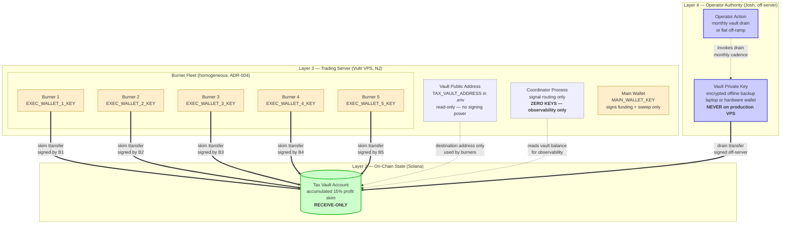

# Tax Vault Trust Boundary Diagram

**Project:** Moss Lane / Lazarus Engine
**Phase:** 3, Slice 1 (Multi-Wallet Architecture Design)
**Author:** Josh Hillard (TPM #4), DevOps #6 lead
**Date:** 2026-04-29
**Companion to:** [ADR_Multi_Wallet_Topology_2026-04-29.md](ADR_Multi_Wallet_Topology_2026-04-29.md) — ADR-006 (Tax Vault Posture)

This is a standalone reference for SecOps and DevOps review. The diagram is also embedded in the ADR; this file is the lift-and-share version.

---

## Purpose

The tax vault is the highest-trust component in the Lazarus capital topology. Its role is to be a one-way ratchet: realized profit moves in, capital does not move out under programmatic control. This diagram formalizes the boundaries that protect that invariant.

The diagram makes explicit what is *forbidden by construction* (the vault private key is not on the trading server) versus what is *forbidden by convention* (a code review must reject any PR adding a vault outbound method).

---

## Layered Trust Diagram

**Legend:**
- 🟢 **Green (receive):** The on-chain vault account, receive-only.
- 🟡 **Yellow (hot):** Wallets with signing keys on the production VPS.
- 🔵 **Blue (cold):** Operator-controlled assets that never touch the server.
- ⚪ **Pale (read-only):** On-server entities that reference the vault but cannot sign for it.
- **Solid arrow (==>):** Allowed capital flow.
- **Dashed arrow (-.->):** Read-only or operator invocation, not a capital flow.

---

## Allowed Edges (5 total)

| # | Edge | Trigger | Initiator | Signed By |
|---|------|---------|-----------|-----------|
| 1 | Burner N → Vault | Accumulated skim ≥ threshold (0.1 SOL mainnet, 0.005 SOL paper) | Burner N's own process | Burner N's keypair |
| 2 | Vault → Cold Storage / Off-Ramp | Operator decision (monthly or threshold-based) | Josh, off-server | Vault keypair (off-server) |
| 3 | Operator → Vault Keypair | Manual drain invocation | Josh | N/A (laptop action) |
| 4 | Coordinator → Vault (read) | Observability dashboard / status reporting | Coordinator process | None — read-only RPC |
| 5 | `.env` → Vault address (read) | Burner needs destination for skim transfer | Burner process at startup | None — config read |

---

## Forbidden Edges (enforced, not just convention)

| Forbidden Edge | Why Forbidden | Enforcement Mechanism | Status |
|----------------|---------------|----------------------|--------|
| Trading server → Vault outbound | Server compromise must not drain vault | Vault private key never on server | ⚠️ Currently violated by [github-repo/src/finance/wallet_generator.py::save_wallets_to_env](../src/finance/wallet_generator.py) — fix in Phase 3 slice 2 |
| Coordinator → Vault outbound | Coordinator holds no keys (ADR-007) | Coordinator `.env` has no `*_KEY` entries + startup assertion | Planned Phase 3 slice 2 |
| Burner → Vault outbound (via drain) | Burner process should not be able to sign for vault | Burner only loads its own `EXEC_WALLET_N_KEY` | ✅ Already true |
| Vault → Burner | Vault is one-way ratchet | TaxVault module exposes no outbound transfer method | ✅ Already true at [github-repo/src/finance/tax_vault.py](../src/finance/tax_vault.py) |
| Vault → Main | Vault never refills hot capital | TaxVault module exposes no outbound transfer method | ✅ Already true |
| Burner ↔ Burner direct | Inter-burner movement must transit Main | FundSplitter only allocates Main → Burner; no burner-to-burner method | ✅ Already true at [github-repo/src/finance/fund_splitter.py](../src/finance/fund_splitter.py) |
| Any process → Vault keypair on server | Compromise of any process becomes vault loss | Vault private key not present in `/home/solbot/lazarus/.env` | ⚠️ Currently violated; fix in Phase 3 slice 2 |

---

## Required Startup Assertions (additions to *Runtime Validation* layer 4)

These run before the engine accepts trade signals. Any failure is fail-closed — the process refuses to start.

1. **`TAX_VAULT_ADDRESS` present.** The receive destination for skims must be configured.
2. **`TAX_VAULT_KEY` absent.** If the vault private key is loadable from the trading server's environment, the process must refuse to start. This is the structural enforcement of ADR-006.
3. **Coordinator zero-key check.** The coordinator process scans its environment for any value that successfully `solders.Keypair.from_bytes()` parses. If any exist, the process refuses to start. This enforces ADR-007.
4. **Vault outbound method absence.** The TaxVault class must not define `transfer_out`, `withdraw`, or any method that returns a signing instruction with the vault as source. Compile-time check via attribute audit in CI.
5. **Executor address ≠ vault address.** FundSplitter configuration must reject any `executor_addresses` list containing the vault address. Defense against typo-driven misallocation.
6. **Allowed-edge invariant.** The capital flow validator must hold the canonical allowed-edge list (the five edges above) and refuse any topology config that adds an edge not on the list.

---

## Failure Modes Specific to This Boundary

| Failure Mode | Effect | Detection | Mitigation |
|--------------|--------|-----------|-----------|
| Vault private key written to server `.env` in a future PR | Server compromise drains vault | Startup assertion #2 above + CI grep for `TAX_VAULT_KEY` write | Reject PR; refuse server startup |
| Coordinator gains a wallet key | ADR-007 violation; centralized signing authority | Startup assertion #3 above | Refuse coordinator startup |
| `transfer_out` method added to TaxVault | Vault becomes spendable from server | Startup assertion #4 + code review checklist | Reject PR |
| Skim destination corrupted (vault address swap attack) | Skim sent to attacker-controlled address | Address validated at startup against signed ground-truth file | Manual address verification in deploy pipeline |
| Vault drained by operator key compromise | Total profit loss | Defense in depth: hardware wallet for vault key, drain only from clean machine | Operational discipline; hardware-wallet-only outbound |
| Vault drain forgotten; vault accumulates large balance | Larger target for sustained attack | Monthly operator review cadence + alert when vault > 5 SOL | Process discipline + dashboard alert |

---

## Reference Citations

This diagram operationalizes the following Foundations boundaries:

- **Trust Model layer 4** (operator authority): vault outbound is Josh's decision, not the engine's. Source: [Foundations/Moss Lane System Trust Model.md](../Foundations/Moss%20Lane%20System%20Trust%20Model.md) — see "Where Final Authority Lives" and "Trust by Layer".
- **Trust Boundaries 7** (deployment truth): a capability is operational only after deployment + verification. Source: [Foundations/Trust Boundaries in the Moss Lane Pipeline.md](../Foundations/Trust%20Boundaries%20in%20the%20Moss%20Lane%20Pipeline.md) — Boundary 7.
- **Transaction Identity**: skim ledger uses `executor_address`, `timestamp`, `tx_signature` — sufficient for reconstruction. Source: [Foundations/Transaction Identity and Auditability.md](../Foundations/Transaction%20Identity%20and%20Auditability.md).
- **Runtime Validation layer 4** (startup assertions): the assertions above extend the existing layer rather than replacing it. Source: [Foundations/Runtime Validation for Adaptive Output.md](../Foundations/Runtime%20Validation%20for%20Adaptive%20Output.md) — "Validation layer 4: startup assertions".

---

*Quiet streets, loud comebacks.*
