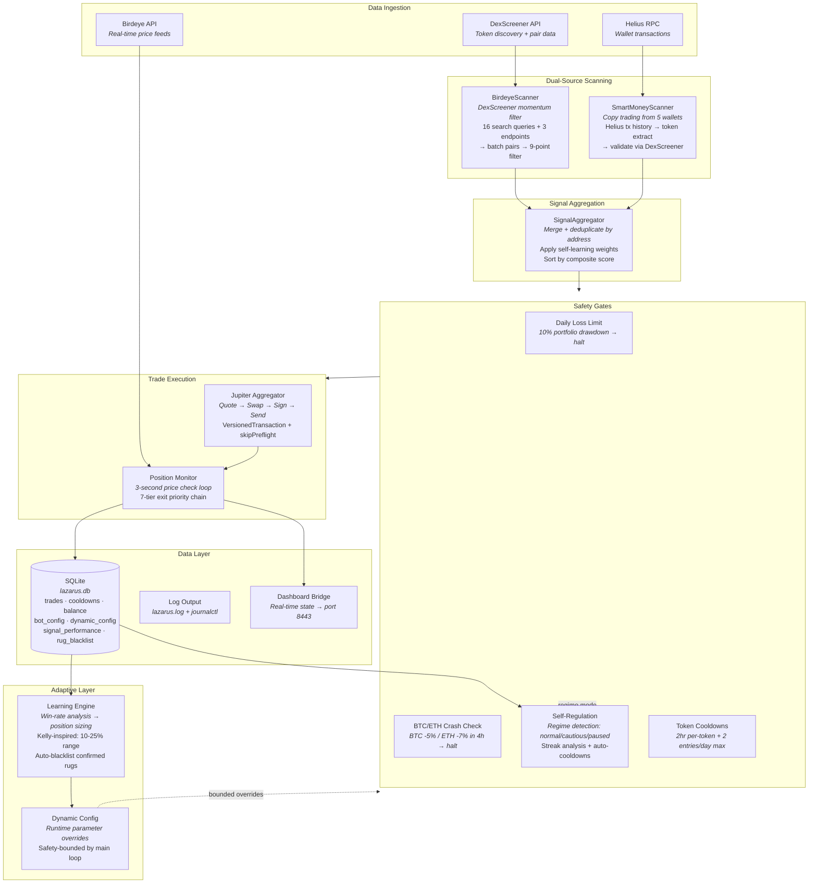
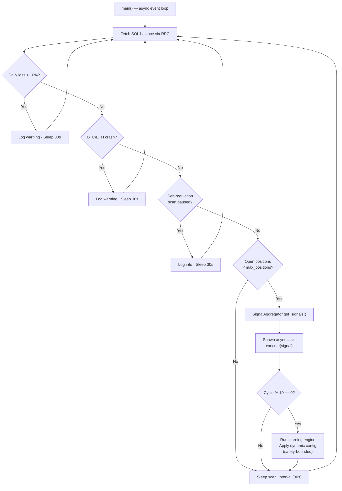

# Lazarus Engine — System Architecture

> Accurate to the running codebase. Nothing inflated, nothing invented.

---

## High-Level System Diagram



---

## The Main Loop



---

## The 9-Point Filter Cascade

Every token discovered by the BirdeyeScanner passes through these filters in order. A single failure rejects the candidate.


---

## The 7-Tier Exit Priority Chain

Once a position is opened, the monitor loop checks exit conditions every 3 seconds in strict priority order. The first condition that triggers wins.

```
Priority 1: HARD FLOOR        -15% at any time → immediate exit
                               (prevents catastrophic rug-pull losses)

Priority 2: EMERGENCY RUG     -12% within first 30 seconds
                               (fast-drop detection for flash crashes)

Priority 3: TAKE PROFIT       +25% → lock in the win

Priority 4: TRAILING STOP     Arms at +8%, then trails 4% below peak
                               (lets winners run, captures the slide)

Priority 5: SNIPER TIMEOUT    60 seconds elapsed, < +1%, trail not armed
                               (cuts non-runners early, preserves capital)

Priority 6: STOP LOSS         -8% → cut the loss
                               (standard risk management)

Priority 7: TIMEOUT           10 min (unarmed), 15 min (trailing armed)
                               (nothing is held forever)
```

---

## The Three-Layer Configuration System

This is the architecture that caught me with a production bug. Lazarus loads config from three layers, each overriding the last:

```
┌─────────────────────────────────────────────────┐
│  LAYER 3: dynamic_config table                  │
│  Written by: Learning Engine                    │
│  Controls: position_pct, stop_loss              │
│  Bounded by: main loop safety clamps            │
│  (position: 10-30%, SL: 3-10%, positions: 1-2)  │
├─────────────────────────────────────────────────┤
│  LAYER 2: bot_config table                      │
│  Written by: Self-Regulation module + manual    │
│  Controls: regime_mode, scan_pause_until         │
│  (ALLOWED_KEYS whitelist enforced)               │
├─────────────────────────────────────────────────┤
│  LAYER 1: CFG dict in lazarus.py                │
│  Written by: Deployment                         │
│  Controls: Everything (defaults)                 │
│  This is the safety net.                         │
└─────────────────────────────────────────────────┘

Rule: Layer 3 > Layer 2 > Layer 1
Lesson: A deployment that updates Layer 1 but not Layer 2
        changes nothing at runtime. Ask me how I know.
```

---

## Database Schema

```
lazarus.db
├── trades              — Full trade history (entry, exit, PnL, exit reason, source)
├── balance_snapshots   — Periodic SOL balance recordings
├── daily_pnl           — Aggregated daily profit/loss
├── cooldowns           — Per-token cooldown tracking (address, expiry, entry count)
├── signal_performance  — Win/loss ratios per signal source
├── wallet_activity     — Smart money wallet transaction log
├── bot_config          — Layer 2 runtime configuration
├── dynamic_config      — Layer 3 learning engine overrides
├── config_audit_log    — Every config change with timestamp + reason
├── rug_blacklist       — Auto-blacklisted tokens (> 15% loss)
├── entry_conditions    — Entry data for condition analysis
├── condition_performance — Bucketed win rates by entry characteristics
├── token_cooldowns     — Self-regulation per-token blocks
└── trade_analysis      — Post-trade analysis records
```

---

## Technology Stack

| Layer | Technology | Why This Choice |
|-------|-----------|-----------------|
| **Language** | Python 3.12 + asyncio | Async event loop for concurrent scan/monitor. Single process, no threading complexity. |
| **External HTTP** | subprocess curl (`curl_get()`) | aiohttp fails silently on external HTTPS. curl is ugly but reliable. Pragmatism over purity. |
| **Internal HTTP** | aiohttp | Works perfectly for RPC + Jupiter (same-process async). Only failed on external APIs. |
| **Swap Execution** | Jupiter Aggregator API | Best price routing across Solana DEXs. Public endpoint, no key needed. |
| **Blockchain** | Solana via Helius RPC | Fast finality (~400ms), low fees. Helius for reliability. |
| **Token Discovery** | DexScreener API | Free, no key needed, broad coverage. Birdeye Standard only returns 20 large caps. |
| **Price Feeds** | Birdeye API | Real-time token pricing for monitor loop. |
| **Database** | SQLite | Single-file, zero config, thread-safe with locking. Perfect for single-node bot. |
| **Signing** | Solders + base58 | `VersionedTransaction(msg, [KP])` — the `.sign()` method was removed in newer versions. |
| **Process Management** | systemd | Auto-restart on crash, log aggregation via journalctl, clean start/stop. |
| **Infrastructure** | Vultr VPS (NJ) | Low-latency US East, $6/mo, Ubuntu 22. |

---

## What Gemini Suggested vs. What Actually Exists

Being honest about this is more impressive than inflating it.

| Gemini's Suggestion | Reality | Status | Rationale |
|--------------------|---------|--------|-----------|
| Dual-stream ingestion (Market + Network) | BirdeyeScanner + SmartMoneyScanner are dual-source, but not streaming — they poll on each cycle | **Exists (polling, not streaming)** | Polling is sufficient at 30s scan intervals. WebSocket streaming would add complexity for marginal latency gains at this scale. |
| RPC congestion monitoring | Not implemented. Could add slot-height checks. | **Planned (v3.5)** | Prioritized execution reliability and exit logic over entry timing. Helius handles basic congestion; custom monitoring is an optimization, not a necessity. |
| Volatility Score for regime detection | Self-regulation checks win rate + consecutive SL streaks, not raw volatility | **Partial — different approach** | Outcome-based regime detection (actual trade results) is more reliable than predictive volatility scoring for a single-asset class. |
| Static → Momentum → Safety filter cascade | 9-point filter cascade exists but runs as a single pass, not three stages | **Exists (single-pass, not staged)** | Single pass through a dictionary-mapped filter set is more computationally efficient and lower latency than three sequential function calls. |
| Rug-pull contract analysis | Auto-blacklists tokens that lost > 15%, but doesn't analyze contract code | **Partial — outcome-based, not contract-based** | Contract analysis requires on-chain bytecode parsing. Outcome-based blacklisting (>15% loss = blacklisted) is simpler and catches the same tokens, just reactively instead of proactively. |
| State locking before transactions | No explicit DB locking before tx send. Uses address set to prevent double-entry. | **Partial — set-based, not lock-based** | In-memory address set is faster than DB locks for a single-process bot. DB locking would matter in multi-wallet/multi-process Phase 2. |
| Circuit breaker: Daily drawdown | Daily loss limit at 10% — exists and working | **Exists** | — |
| Circuit breaker: Sniper timeout | 60-second sniper exit — exists and working | **Exists (60s, not 180s)** | 60s was tuned from trade data. 180s let too many losers bleed capital. |
| Circuit breaker: RPC health check | Not implemented. Monitor loop has 5s timeout per price fetch + stale detection. | **Partial — timeout only, not latency-based** | 5s timeout + stale detection (18 zero-price reads → exit) handles the 80% case. Proactive latency monitoring is a v3.5 item. |
| "High-Availability Momentum Loop" | It's a single async event loop. High-availability would require failover, which doesn't exist. | **Honest: resilient via systemd, not HA** | systemd auto-restart gives ~10s recovery. True HA (hot standby) is over-engineered for a $103 account. Appropriate for Phase 2 multi-wallet. |

---

## What Makes This Architecture Interesting (For Interviewers)

### 1. Production-First Thinking: The `curl_get()` Decision
I replaced the "right" tool (native async HTTP) with subprocess curl because aiohttp silently dropped external API responses. In a world of "clean code" purists, choosing a subprocess call over an async library because of silent failures demonstrates that I care more about system reliability than "correct" syntax. The system doesn't care how elegant the code is — it cares whether the data arrives.

### 2. State Management: The Three-Layer Config Hierarchy
Most bots have a config file. Lazarus has three layers of runtime configuration with safety bounds, and I learned the hard way what happens when you deploy to one layer and forget the other two.

**The interview version:** "I designed a 3-layer configuration system to allow for real-time, self-learning overrides without touching the core code. But I initially overlooked the State Persistence problem — I deployed an update to the code layer, but the database layer held stale values. This resulted in an 8-hour 'Ghost Scan' where the bot was active but functionally blind. I didn't just fix the bug; I implemented a Config Audit Log and Safety Clamps in the main loop to ensure no override can ever push the system into an unsafe state."

### 3. Deterministic Exit Logic: The 7-Tier Priority Chain
Exit logic is harder than entry logic. Most developers write a simple `if price > target`. Lazarus uses a priority-ordered exit chain where each tier exists because a specific failure mode was observed: hard floor because of rug pulls, emergency rug because of flash crashes, sniper timeout because of non-runners eating capital, trailing stop because fixed take-profits leave money on the table. Explaining why "Hard Floor" has priority over "Trailing Stop" proves understanding of risk hierarchies in high-volatility environments.

### 4. The Guardrail Pattern: Safety-Bounded Autonomy
The learning engine adjusts position sizing based on win rate, but the main loop clamps every value to a safe range (position: 10-30%, stop-loss: 3-10%, max positions: 1-2). The learning engine can suggest — it can never break the system. This is the **Guardrail Pattern** used in mission-critical systems: allow algorithmic optimization without risking total system failure. The autonomy is "suggestive, not authoritative."

### 5. Async Concurrency: Not Threading, Not Multiprocessing
While the monitor loop is watching a position (I/O-bound, waiting for price data), the main loop can continue scanning for the next opportunity. This is real concurrency — not multithreading, not multiprocessing, but async I/O multiplexing via Python's `asyncio`. One event loop, zero race conditions, clean task management.

### 6. Data Reduction at Scale: The Filter Funnel
Each scan cycle discovers ~200 tokens. The 9-point filter cascade reduces that to 0-5 candidates. That's a 96-98% rejection rate — the system's job isn't to find things to buy, it's to find reasons NOT to buy. This framing matters: Lazarus is a risk engine that occasionally trades, not a trading engine that occasionally manages risk.

5. **The async architecture.** While the monitor loop is watching a position (I/O-bound, waiting for price data), the main loop can continue scanning for the next opportunity. This is real concurrency — not multithreading, not multiprocessing, but async I/O multiplexing.
